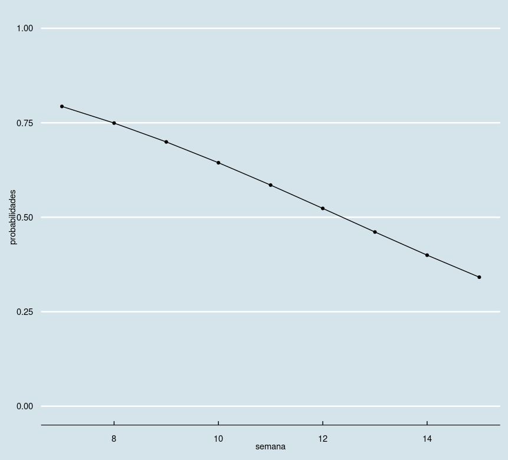
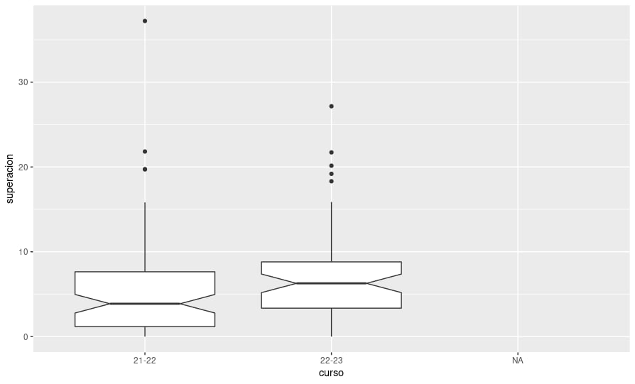

# Semana del 24 de octubre

**Importante** Continúa el *hacktoberfest*. Buscad *issues* en GitHub con la
etiqueta *hacktoberfest* en todo GitHub y GitLab. Recordad añadir
`hacktoberfest` como topic de vuestro repositorio, para que beneficie a quien
vaya a trabajar en él.

Por ejemplo, en [el material de la asignatura](https://github.com/JJ/IV).

Seguimos aconsejando muy vivamente la asistencia a clase, especialmente para
quien esté trabajando en los objetivos cero o uno.

## Antes de la clase

En el curso 2021-22,

* El 50% había entregado ya el [objetivo
  2](https://jj.github.io/IV/documentos/proyecto/2.Entidad).
* El 90% ya había entregado el [objetivo
  1](http://jj.github.io/IV/documentos/proyecto/1.Infraestructura), y el 50% lo
  había superado.

Todas las *personas que aprobaron* habían superado el objetivo 0. Si todavía no
has superado el objetivo 0, aconsejamos que te planifiques el resto de la
asignatura para la [convocatoria
extraordinaria](instrucciones-ordinaria-extraordinaria.md).

Por otro lado, la probabilidad de aprobar en la convocatoria ordinaria (enero)
según la semana de *entrega* del objetivo 3 sigue el siguiente gráfico

Por lo que sería *extremadamente conveniente* que en planificara la finalización
de los objetivos anteriores y la entrega del 3 *lo antes posible* y siempre
antes de la **semana número 12** (principios de diciembre).

## Objetivos

1. Entender el flujo HU → hito → issue → mensaje de commit → código y cómo es
   importante para auto-documentar el código.

## Errores comunes (para referencia)

Es importante que recordéis que **hay que superar hasta el objetivo 5 para aprobar la
asignatura**, en la convocatoria ordinaria o la extraordinaria. El estudiante
tendrá que acomodar su ritmo de trabajo a este plan, ya que los objetivos se
pueden entregar cuando se desee, con la salvedad de que hay que entregarlos de
forma secuencial. Por lo tanto, un *error común* es no haber entregado, a estas
alturas, el objetivo 2 tras haber superado el uno (tan común como el 88% de la
clase).

* Todos los objetivos:
  * No corregir inmediatamente los errores de test que se produzcan al hacer la
    entrega.
  * No entender que la columna de versión está precisamente para relanzar los
    tests en caso de que se haya corregido en el repositorio propio el error que
    haya ocurrido.
  * No corregir con más o menos celeridad el objetivo cuando se hace la
    corrección por el profesor, en todo caso antes de la siguiente sesión. Y si
    todavía no se ha logrado corregir, no ir a clase para poder solucionar el
    problema sobre la marcha. El plazo medio transcurrido entre entrega y
    superación del objetivo en el 21-22 era de unos 4 días. Este año es de 6
    días.

* Todos los objetivos a partir del 1
  * El repositorio debe describir un proyecto, no entregas de una asignatura. Se
    deben evitar referencias a "objetivos", porque los objetivos son etapas que
    hay que cubrir en el proyecto. En todo caso, debería organizarse la
    documentación en milestones, pero lo correcto es organizarla para que una
    persona que quiera usar el proyecto en el estado actual pueda hacerlo.
  * Evitar incluir en el PR cambios o ediciones que correspondan a mejoras del
    objetivo anterior. El PR debe incluir sólo lo necesario para superar el
    objetivo que se esté evaluando.
* Objetivo 1
  * En general, cada milestone/PMV corresponde a un paso en el desarrollo de un
    producto. En el caso de nuestra asignatura, están condensados. Pero
    *siempre* hay que empezar por entender el problema haciendo un modelo del
    mismo, usando la metodología de *design thinking* o algún otro enfoque
    sistemático que pase del dominio del problema a la implementación. Sin este
    modelo (cuyo producto tendrá que tener la forma de código, que además
    compile), no se puede pasar al milestone siguiente.
  * Hay que identificar claramente al cliente, porque para esa persona o grupo
    se escribe la historia de usuario.
* Objetivo 2: en este objetivo se trata, en general, de entender la metodología
  por la cual sólo se añade código si lo necesita el cliente. Conviene repasar
  el objetivo número 1 de esta semana (y de las anteriores).
  * Lo esencial en este objetivo es modelizar el problema, lo que estará en el
    milestone 0 del repositorio en el que se trabaje. Este milestone tendrá
    designada al menos una historia de usuario. Hay que empezar creando una
    serie de issues a partir de esa historia de usuario para entender
    exactamente qué es lo que necesita la lógica de negocio.
  * Los mensajes de commit deben hacer referencia a estos objetivos creados,
    porque todo lo que se añada al repo debe estar en relación con el beneficio
    del cliente.
  * El *error más frecuente* es tomar los diferentes objetos descritos o
    imaginados a partir de una historia de usuario y *proponer* unas estructuras
    de datos sin ninguna relación con el problema ni la lógica de negocio.
* Objetivo 3: No haberlo entregado.

## Otras sesiones

* [Sexta semana](semana-06.md)
* [Octava semana](semana-08.md)

